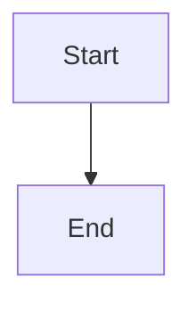

# PRD: <PROJECT>-<TYPE>-<NNN> - Feature name>

## 1. Change Log

| Date | Change | Owner | Rationale |
|------|--------|-------|-----------|

## 2. Header

| Field | Value |
|-------|-------|
| Feature | |
| Channels | |
| Status (owning team) | |
| Owner (PM) | |
| Contributors | |
| Created | |
| Last updated | |
| Figma | |
| Jira | |
| API Spec | |
| Links (optional) | shared context: [Shared general context](https://lotusflare.atlassian.net/wiki/spaces/AIDR/pages/7693467649/Shared+general+context+product-wide+rules) |

## 3. Central requirement + Scope

### a. Central requirement

### b. Goals

-

### c. Non-Goals

-

### d. Entry points

N / A

### e. Exit points

N / A

## 4. User Journey

## 5. Acceptance Criteria

| ID | Given | When | Then (one observable outcome) |
|----|-------|------|-------------------------------|
| AC-01 | | | |

## 6. Edge cases & error cases

| ID | Case (category) | Trigger / entry | Expected behavior (observable) | Exit / recovery |
|----|-----------------|-----------------|--------------------------------|-----------------|
| EC-01 | | | | |

## 7. Data Mapping

| UI element / label | Endpoint | Field | Empty / fallback | Notes |
|--------------------|----------|-------|------------------|-------|
| | | | | |
