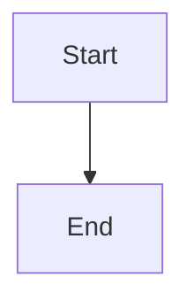

# PRD: <PROJECT>-<TYPE>-<NNN> - Feature name>

> **Authoring:** Follow [../reference/section-instructions.md](../reference/section-instructions.md) for every section. Parent owns §1–4; children own §5–7. Saved PRDs must not include these help lines.

## 1. Change Log

> **Empty during generate-prd.** `publish-prd` appends a publish row; `design-prd-consistency` appends `Updated from design` after accepted design edits. See section-instructions §1.

| Date | Change | Owner | Rationale |
|------|--------|-------|-----------|

## 2. Header

> Owning-team status: PM — drafting / Design — in design / Engineering — in build / Shipped. See section-instructions §2.

| Field | Value |
|-------|-------|
| Feature | <one short name> |
| Channels | <App / App + Web — ask before generating if unknown> |
| Status (owning team) | <PM — drafting / Design — in design / Engineering — in build / Shipped> |
| Owner (PM) | <name — accountable for product decisions in this doc> |
| Contributors | <PM name(s) who authored/edited this PRD; append on later PM edits> |
| Created | <YYYY-MM-DD> |
| Last updated | <YYYY-MM-DD> |
| Figma | <separately attached team design link — not generation input; leave TBD if none> |
| Confluence | <this PRD’s Confluence page URL after publish-prd; TBD until first publish> |
| Jira | <tickets> |
| API Spec | <N / A until api-mapping attaches the operation YAML on match> |
| Links (optional) | shared context: [Shared general context](https://lotusflare.atlassian.net/wiki/spaces/AIDR/pages/7693467649/Shared+general+context+product-wide+rules) |

## 3. Central requirement + Scope

### a. Central requirement

> **High-level requirement summary** — what this feature must deliver. Typically one sentence. No mix/validation/field detail. See section-instructions §3a.

<Single sentence.>

### b. Goals

> **High-level** — what the user will **accomplish** on this screen. One Goal is enough. Not what each button or control does — sort, open, delete, and other per-control behavior belong in §5. **Do not expand** beyond this page. See section-instructions §3b.

- <Goal 1>
- <Goal 2>

### c. Non-Goals

> **Out of scope** for **on-page** elements / confirmed hand-offs only — **ask / user-stated**; do not invent; **do not expand** into pages/products with no on-page element. Do not restate Goals. See section-instructions §3c.

- <Non-goal 1>
- <Non-goal 2>

### d. Entry points

> **Optional.** Page → **`N / A`** when a journey PRD defines the path. Journey → **`N / A`** when the mermaid clearly defines the path. Fill In|Out table only if needed (never invent). See authoring-rules §6 / section-instructions §3d.

N / A

### e. Exit points

> **Optional.** Same rules as entry points. CTA destinations still go in §5 hand-offs when §3e is `N / A`. See authoring-rules §6 / section-instructions §3e.

N / A

## 4. User Journey

> Always keep this heading. **Applies to journey PRD** (happy-path mermaid). **Page PRD → automatically `N / A`.** See section-instructions §4.

## 5. Acceptance Criteria

> Owned by `write-ac-and-edge-cases`. Happy case only: what user sees / can do / what happens on actions. Journey: only what is **not** in the mermaid. One **action** → one Then. Complex pages: skeleton see-AC first, then per-section see ACs. No “successfully”. See section-instructions §5.

| ID | Given | When | Then (one observable outcome) |
|----|-------|------|-------------------------------|
| AC-01 | <precondition> | <trigger> | <full result — one sentence if short; bullets with ` ` if long> |

## 6. Edge cases & error cases

> Owned by `write-ac-and-edge-cases`. Feature-related edges/negatives only (technical → shared general context). Abstract situation + intended outcome. Journey: only what is **not** in the mermaid. See section-instructions §6.

| ID | Case (category) | Trigger / entry | Expected behavior (observable) | Exit / recovery |
|----|-----------------|-----------------|--------------------------------|-----------------|
| EC-01 | <category> | <trigger> | <what user sees> | <recovery> |

## 7. Data Mapping

> Owned by `write-data-mapping`. **Dynamic** UI fields → API only (not static CTAs / nav). `N / A` if none. See section-instructions §7.

| UI element / label | Endpoint | Field | Empty / fallback | Notes |
|--------------------|----------|-------|------------------|-------|
| <label> | <GET /path> | <data.field> | <fallback> | <notes> |
