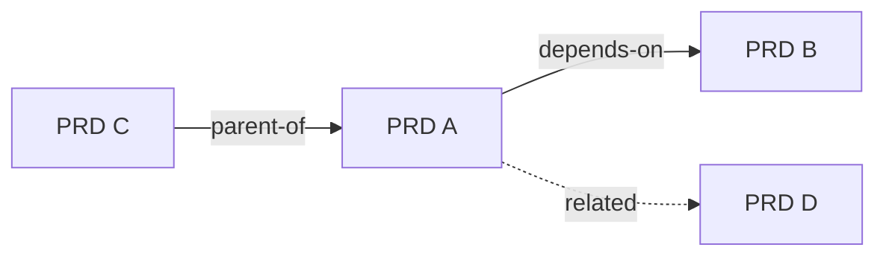

# PRD relationship map

Generated: YYYY-MM-DD

## Index

| PRD | Status | Summary |
|-----|--------|---------|
| [title](../path.md) | Draft | One line |

## Relationships

| From | Type | To | Notes |
|------|------|----|-------|
| prd-a | depends-on | prd-b | Why |

## Graph (Mermaid)

## Gaps & risks

- Missing parent for …
- Duplicate scope between …
- Circular dependency: …
