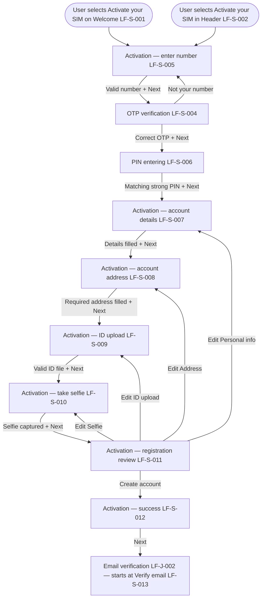

# PRD: LF-J-001 - Create Account

## 1. Change Log

| Date | Change | Owner | Rationale |
| ---- | ------ | ----- | --------- |
| 2026-09-11 | Updated on Confluence | Nan Dong | Design and handoff walkthrough updates |
| 2026-09-11 | Updated from design | Nan Dong | Mermaid start includes Header Activate your SIM |
| 2026-09-11 | Updated from design | Nan Dong | Restart from Activate your SIM starts blank at enter number |
| 2026-09-11 | Updated from design | Nan Dong | OTP continues with Next |
| 2026-09-10 | Updated from design | Nan Dong | Review CTA is Create account; attached Create Account Figma |
| 2026-09-10 | Updated on Confluence | Nan Dong | Header Links: Confluence URLs for shared context and page template |
| 2026-09-09 | Updated on Confluence | Nan Dong | Overwrite Prebuilt PRDs folder from local catalog |
| 2026-08-31 | Updated on Confluence | Nan Dong | Overwrite Prebuilt PRDs folder from local catalog |
| 2026-08-17 | Updated on Confluence | Nan Dong | Overwrite Prebuilt PRDs folder from local catalog |

## 2. Header

| Field                | Value          |
| -------------------- | -------------- |
| Feature              | Create Account |
| Channels             | App + Web      |
| Status (owning team) | PM — drafting  |
| Owner (PM)           | Nan Dong       |
| Contributors         | Nan Dong       |
| Created              | 2026-08-11     |
| Last updated         | 2026-09-11  |
| Figma                | [Prebuilt Page Templates — Create Account](https://www.figma.com/design/X3GsrESJS5Ygq67qI0GJ8D/Prebuilt-Page-Templates?node-id=84-32299&m=dev) |
| Jira                 | —              |
| API Spec             | N / A          |
| Links (optional)     | shared context: [Shared general context](https://lotusflare.atlassian.net/wiki/spaces/AIDR/pages/7693467649/Shared+general+context+product-wide+rules) |
## 3. Central requirement + Scope

### a. Central requirement

The create-account journey is where the user activates their SIM and registers an account, from entering their number through OTP, PIN, personal details, and ID checks to registration success.

### b. Goals

- Enter and verify a mobile number to start activation
- Create a login PIN for the number
- Enter personal details, address, ID, and selfie
- Review details and create the account
- See that registration is complete and continue

### c. Non-Goals

- Field-level rules on each screen (owned by OTP verification (LF-S-004) and Activation screens (LF-S-005–LF-S-012))

### d. Entry points

| Entry point                                              | In or out of scope? | Note                                                          |
| -------------------------------------------------------- | ------------------- | ------------------------------------------------------------- |
| User selects **Activate your SIM** on Welcome (LF-S-001) | In                  | Starts create account at Activation — enter number (LF-S-005) |
| User selects **Activate your SIM** in Header (LF-S-002)  | In                  | Starts create account at Activation — enter number (LF-S-005) |

### e. Exit points

| Exit point                                               | In or out of scope? | Note                         |
| -------------------------------------------------------- | ------------------- | ---------------------------- |
| User selects **Next** on Activation — success (LF-S-012) | In                  | Starts email verification (LF-J-002) at Verify email (LF-S-013) |

## 4. User Journey

## 5. Acceptance Criteria

N / A

## 6. Edge cases & error cases

| ID | Case (category) | Trigger / entry | Expected behavior (observable) | Exit / recovery |
| --- | --- | --- | --- | --- |
| EC-01 | Edge — re-enter create account | The user leaves create account before success, then selects **Activate your SIM** on Welcome (LF-S-001) or in Header (LF-S-002) again | - The user starts create account again at Activation — enter number (LF-S-005) - Values entered in the previous attempt are not shown | The user continues the journey from enter number |

## 7. Data Mapping

N / A