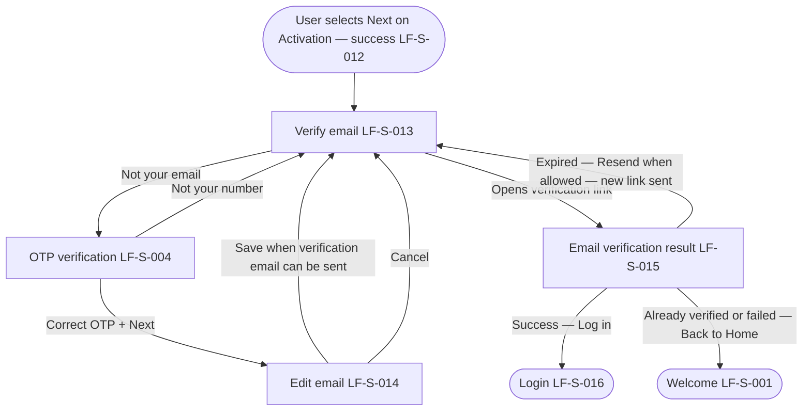

# PRD: LF-J-002 - Email Verification

## 1. Change Log

| Date | Change | Owner | Rationale |
| ---- | ------ | ----- | --------- |
| 2026-09-18 | Updated on Confluence | Nan Dong | OTP mermaid continues with Next |
| 2026-09-11 | Updated from design | Nan Dong | OTP continues with Next |
| 2026-09-10 | Updated on Confluence | Nan Dong | Header Links: Confluence URLs for shared context and page template |
| 2026-09-09 | Updated on Confluence | Nan Dong | Overwrite Prebuilt PRDs folder from local catalog |
| 2026-08-31 | Updated on Confluence | Nan Dong | Overwrite Prebuilt PRDs folder from local catalog |
| 2026-08-17 | Updated on Confluence | Nan Dong | Overwrite Prebuilt PRDs folder from local catalog |

## 2. Header

| Field                | Value              |
| -------------------- | ------------------ |
| Feature              | Email Verification |
| Channels             | App + Web          |
| Status (owning team) | PM — drafting      |
| Owner (PM)           | Nan Dong           |
| Contributors         | Nan Dong           |
| Created              | 2026-08-12         |
| Last updated         | 2026-09-18  |
| Figma                | N / A                |
| Confluence           | [PRD: LF-J-002 - Email Verification](https://lotusflare.atlassian.net/wiki/spaces/AIDR/pages/7692091431/PRD+LF-J-002+-+Email+Verification) |
| Jira                 | —                  |
| API Spec             | N / A              |
| Links (optional)     | shared context: [Shared general context](https://lotusflare.atlassian.net/wiki/spaces/AIDR/pages/7693467649/Shared+general+context+product-wide+rules) |
## 3. Central requirement + Scope

### a. Central requirement

The email verification journey is where the user verifies the email used at registration, can change that email after OTP, and sees the matching verification result when they open a verification link.

### b. Goals

- See that a verification link was sent and resend it when allowed
- Change the email after OTP when the email shown is wrong
- Open a verification link and see the result for that situation

### c. Non-Goals

- Field-level rules on each screen (owned by OTP verification (LF-S-004), Verify email (LF-S-013), Edit email (LF-S-014), and Email verification result (LF-S-015))

### d. Entry points

| Entry point                                              | In or out of scope? | Note                                                 |
| -------------------------------------------------------- | ------------------- | ---------------------------------------------------- |
| User selects **Next** on Activation — success (LF-S-012) | In                  | Starts email verification at Verify email (LF-S-013) |

### e. Exit points

| Exit point | In or out of scope? | Note |
|------------|---------------------|------|
| User selects **Log in** on Email verification result (LF-S-015) — success | In | Login (LF-S-016) |

## 4. User Journey

## 5. Acceptance Criteria

N / A

## 6. Edge cases & error cases

N / A

## 7. Data Mapping

N / A