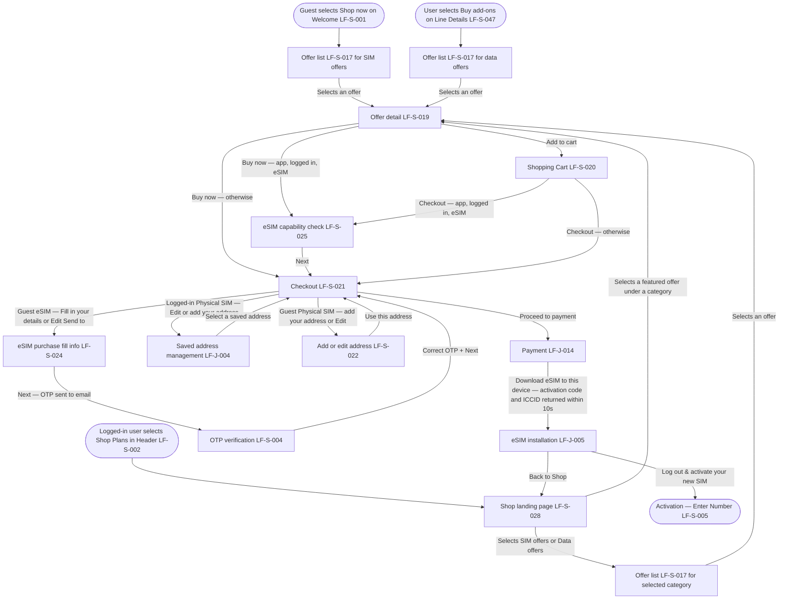

# PRD: LF-J-003 - Shop Purchase

## 1. Change Log

| Date | Change | Owner | Rationale |
| ---- | ------ | ----- | --------- |
| 2026-09-11 | Updated from design | Nan Dong | OTP continues with Next |
| 2026-09-10 | Updated on Confluence | Nan Dong | Header Links: Confluence URLs for shared context and page template |
| 2026-09-10 | Updated on Confluence | Nan Dong | Overwrite Prebuilt PRDs folder from local catalog |
| 2026-08-31 | First publish to Confluence | Nan Dong | Initial publish to Prebuilt PRDs folder |

## 2. Header

| Field                | Value           |
| -------------------- | --------------- |
| Feature              | Shop Purchase   |
| Channels             | App + Web       |
| Status (owning team) | PM — drafting   |
| Owner (PM)           | Nan Dong        |
| Contributors         | Nan Dong        |
| Created              | 2026-08-26      |
| Last updated         | 2026-09-11 |
| Figma                | N / A           |
| Jira                 | —               |
| API Spec             | N / A           |
| Links (optional)     | shared context: [Shared general context](https://lotusflare.atlassian.net/wiki/spaces/AIDR/pages/7693467649/Shared+general+context+product-wide+rules) |

## 3. Central requirement + Scope

### a. Central requirement

The shop purchase journey is where the user browses offers and completes a purchase. Guests enter from Welcome and can purchase SIM offers only. Logged-in users enter from the Shop landing page and can browse all offer categories. Logged-in users also enter from Line Details for data offers. After offer selection, the purchase path through cart, checkout, and payment is the same, with checkout branches for eSIM fill details, guest Physical SIM address, and logged-in Physical SIM saved address management (LF-J-004). After payment, an eSIM purchase can show an eSIM QR code on Payment result, or a logged-in app download to this device continues in eSIM installation (LF-J-005).

### b. Goals

- Enter shop as a guest and purchase SIM offers only
- Enter shop while logged in and browse all offer categories
- Open an offer, add it to cart or buy now, and check out
- Add a delivery address as a guest for a Physical SIM purchase
- Open saved address management (LF-J-004) while logged in for a Physical SIM purchase
- Complete payment and see the payment result
- Set up a purchased eSIM with a QR code or with eSIM installation (LF-J-005)

### c. Non-Goals

N / A

### d. Entry points

N / A

### e. Exit points

N / A

## 4. User Journey

## 5. Acceptance Criteria

N / A

## 6. Edge cases & error cases

N / A

## 7. Data Mapping

N / A
