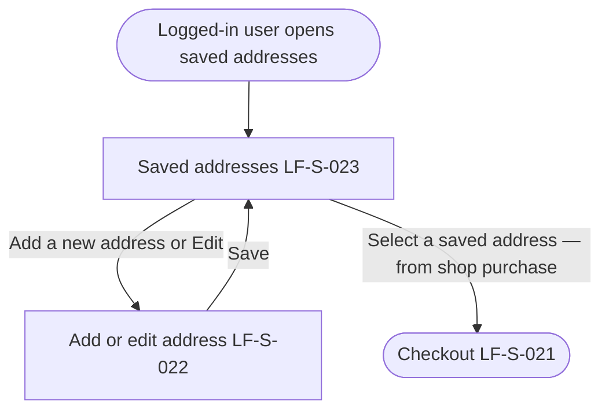

# PRD: LF-J-004 - Saved Address Management

## 1. Change Log

| Date | Change | Owner | Rationale |
| ---- | ------ | ----- | --------- |
| 2026-09-10 | Updated on Confluence | Nan Dong | Header Links: Confluence URLs for shared context and page template |
| 2026-09-10 | Updated on Confluence | Nan Dong | Overwrite Prebuilt PRDs folder from local catalog |
| 2026-08-31 | First publish to Confluence | Nan Dong | Initial publish to Prebuilt PRDs folder |

## 2. Header

| Field                | Value                      |
| -------------------- | -------------------------- |
| Feature              | Saved Address Management   |
| Channels             | App + Web                  |
| Status (owning team) | PM — drafting              |
| Owner (PM)           | Nan Dong                   |
| Contributors         | Nan Dong                   |
| Created              | 2026-08-26                 |
| Last updated         | 2026-09-10 |
| Figma                | N / A                      |
| Jira                 | —                          |
| API Spec             | N / A                      |
| Links (optional)     | shared context: [Shared general context](https://lotusflare.atlassian.net/wiki/spaces/AIDR/pages/7693467649/Shared+general+context+product-wide+rules) |

## 3. Central requirement + Scope

### a. Central requirement

The saved address management journey is where a logged-in user reviews, adds, and edits saved delivery addresses, using Saved addresses and Add or edit address.

### b. Goals

- Open saved addresses while logged in
- Review saved delivery addresses
- Add or edit a saved address

### c. Non-Goals

N / A

### d. Entry points

N / A

### e. Exit points

N / A

## 4. User Journey

## 5. Acceptance Criteria

N / A

## 6. Edge cases & error cases

| ID | Case (category) | Trigger / entry | Expected behavior (observable) | Exit / recovery |
| --- | --- | --- | --- | --- |
| EC-01 | Edge — re-enter saved addresses | The logged-in user leaves saved address management, then opens saved addresses again | The user starts again at Saved addresses (LF-S-023) | The user continues the journey from Saved addresses |

## 7. Data Mapping

N / A
