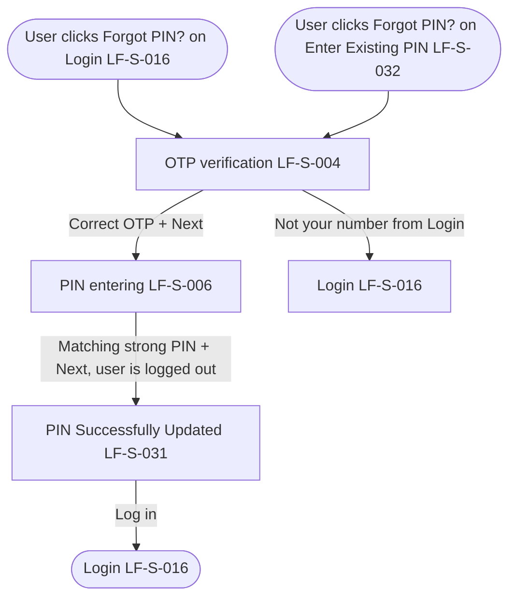

# PRD: LF-J-006 - Forgot PIN

## 1. Change Log

| Date | Change | Owner | Rationale |
| ---- | ------ | ----- | --------- |
| 2026-09-11 | Updated from design | Nan Dong | OTP continues with Next |
| 2026-09-10 | Updated on Confluence | Nan Dong | Header Links: Confluence URLs for shared context and page template |
| 2026-09-09 | Updated on Confluence | Nan Dong | Overwrite Prebuilt PRDs folder from local catalog |
| 2026-08-31 | First publish to Confluence | Nan Dong | Initial publish to Prebuilt PRDs folder |

## 2. Header

| Field                | Value      |
| -------------------- | ---------- |
| Feature              | Forgot PIN |
| Channels             | App + Web  |
| Status (owning team) | PM — drafting |
| Owner (PM)           | Nan Dong   |
| Contributors         | Nan Dong   |
| Created              | 2026-08-31 |
| Last updated         | 2026-09-11  |
| Figma                | N / A      |
| Jira                 | —          |
| API Spec             | N / A      |
| Links (optional)     | shared context: [Shared general context](https://lotusflare.atlassian.net/wiki/spaces/AIDR/pages/7693467649/Shared+general+context+product-wide+rules) |

## 3. Central requirement + Scope

### a. Central requirement

The Forgot PIN journey is where the user resets their login PIN after verifying an OTP, is logged out when the PIN is updated, then sees that the PIN was reset.

### b. Goals

- Verify the mobile number with OTP
- Set a new 6-digit login PIN
- See that the PIN was reset and go to log in

### c. Non-Goals

N / A

### d. Entry points

N / A

### e. Exit points

N / A

## 4. User Journey

## 5. Acceptance Criteria

N / A

## 6. Edge cases & error cases

N / A

## 7. Data Mapping

N / A
