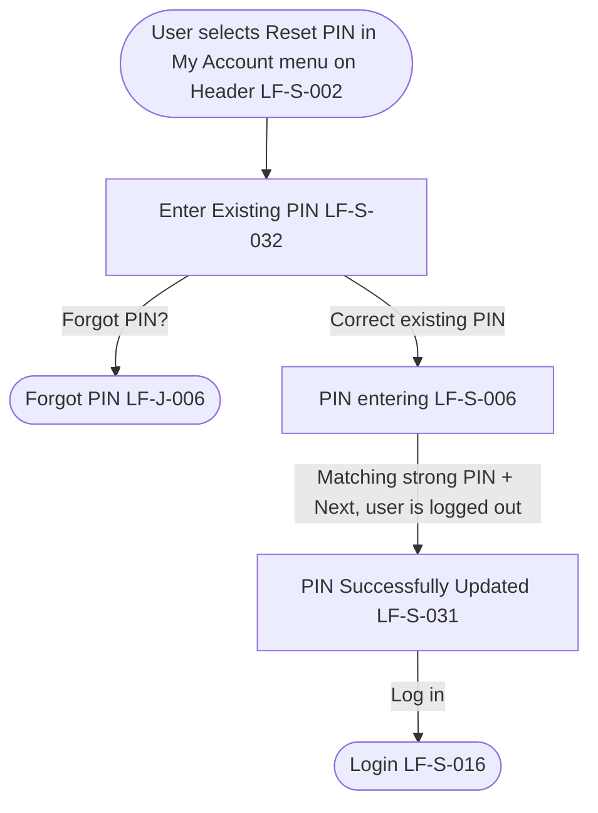

# PRD: LF-J-007 - Reset PIN

## 1. Change Log

| Date | Change | Owner | Rationale |
| ---- | ------ | ----- | --------- |
| 2026-09-10 | Updated on Confluence | Nan Dong | Header Links: Confluence URLs for shared context and page template |
| 2026-09-09 | Updated on Confluence | Nan Dong | Overwrite Prebuilt PRDs folder from local catalog |
| 2026-08-31 | First publish to Confluence | Nan Dong | Initial publish to Prebuilt PRDs folder |

## 2. Header

| Field                | Value     |
| -------------------- | --------- |
| Feature              | Reset PIN |
| Channels             | App + Web |
| Status (owning team) | PM — drafting |
| Owner (PM)           | Nan Dong  |
| Contributors         | Nan Dong  |
| Created              | 2026-08-31 |
| Last updated         | 2026-09-10  |
| Figma                | N / A     |
| Jira                 | —         |
| API Spec             | N / A     |
| Links (optional)     | shared context: [Shared general context](https://lotusflare.atlassian.net/wiki/spaces/AIDR/pages/7693467649/Shared+general+context+product-wide+rules) |

## 3. Central requirement + Scope

### a. Central requirement

The Reset PIN journey is where a logged-in user confirms their existing login PIN, sets a new one, is logged out when the PIN is reset, and sees that the PIN was successfully reset.

### b. Goals

- Confirm the existing login PIN
- Set a new 6-digit login PIN
- See that the PIN was successfully reset
- Go to log in

### c. Non-Goals

N / A

### d. Entry points

N / A

### e. Exit points

N / A

## 4. User Journey

## 5. Acceptance Criteria

N / A

## 6. Edge cases & error cases

N / A

## 7. Data Mapping

N / A
