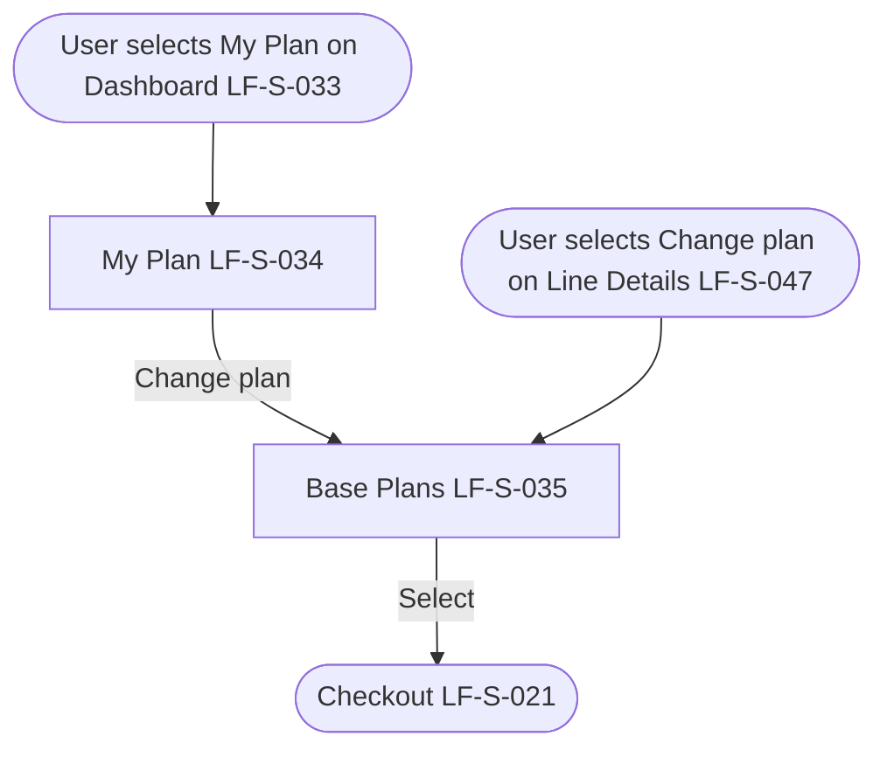

# PRD: LF-J-010 - Base Plan Management

## 1. Change Log

| Date | Change | Owner | Rationale |
| ---- | ------ | ----- | --------- |
| 2026-09-10 | Updated on Confluence | Nan Dong | Header Links: Confluence URLs for shared context and page template |
| 2026-09-10 | First publish to Confluence | Nan Dong | Initial publish to Prebuilt PRDs folder |

## 2. Header

| Field                | Value                  |
| -------------------- | ---------------------- |
| Feature              | Base Plan Management   |
| Channels             | App + Web              |
| Status (owning team) | PM — drafting          |
| Owner (PM)           | Nan Dong               |
| Contributors         | Nan Dong               |
| Created              | 2026-09-04             |
| Last updated         | 2026-09-10              |
| Figma                | N / A                  |
| Jira                 | —                      |
| API Spec             | N / A                  |
| Links (optional)     | shared context: [Shared general context](https://lotusflare.atlassian.net/wiki/spaces/AIDR/pages/7693467649/Shared+general+context+product-wide+rules) |

## 3. Central requirement + Scope

### a. Central requirement

The Base Plan Management journey is where the logged-in user reviews the base plan for a SIM and can select a different base plan. A base plan is the plan and the data sold together with that SIM. After the user pays for a selected base plan, that base plan is the current plan for that SIM.

### b. Goals

- Review the base plan for a SIM
- Choose a different base plan

### c. Non-Goals

N / A

### d. Entry points

N / A

### e. Exit points

N / A

## 4. User Journey

## 5. Acceptance Criteria

N / A

## 6. Edge cases & error cases

N / A

## 7. Data Mapping

N / A
