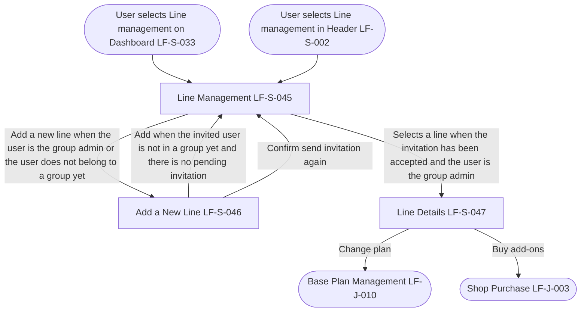

# PRD: LF-J-011 - Line Management

## 1. Change Log

| Date | Change | Owner | Rationale |
| ---- | ------ | ----- | --------- |
| 2026-09-10 | Updated on Confluence | Nan Dong | Header Links: Confluence URLs for shared context and page template |
| 2026-09-10 | First publish to Confluence | Nan Dong | Initial publish to Prebuilt PRDs folder |

## 2. Header

| Field                | Value            |
| -------------------- | ---------------- |
| Feature              | Line Management  |
| Channels             | App + Web        |
| Status (owning team) | PM — drafting    |
| Owner (PM)           | Nan Dong         |
| Contributors         | Nan Dong         |
| Created              | 2026-09-04       |
| Last updated         | 2026-09-10        |
| Figma                | N / A            |
| Confluence           | [PRD: LF-J-011 - Line Management](https://lotusflare.atlassian.net/wiki/spaces/AIDR/pages/7791870008/PRD+LF-J-011+-+Line+Management) |
| Jira                 | —                |
| API Spec             | N / A            |
| Links (optional)     | shared context: [Shared general context](https://lotusflare.atlassian.net/wiki/spaces/AIDR/pages/7693467649/Shared+general+context+product-wide+rules) |

## 3. Central requirement + Scope

### a. Central requirement

The Line Management journey is where the logged-in user reviews their lines and adds a line. The group admin reviews a selected line when the invitation has been accepted.

### b. Goals

- Review their lines
- Add a new line
- Review a selected line as the group admin when the invitation has been accepted

### c. Non-Goals

N / A

### d. Entry points

N / A

### e. Exit points

N / A

## 4. User Journey

## 5. Acceptance Criteria

N / A

## 6. Edge cases & error cases

N / A

## 7. Data Mapping

N / A
