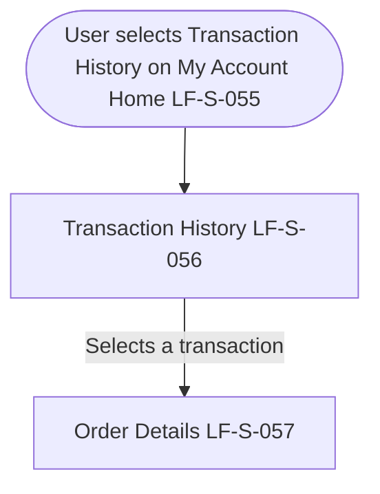

# PRD: LF-J-015 - Transaction History

## 1. Change Log

| Date | Change | Owner | Rationale |
|------|--------|-------|-----------|
| 2026-09-18 | First publish to Confluence | Nan Dong | Initial publish to Prebuilt PRDs folder |

## 2. Header

| Field | Value |
|-------|-------|
| Feature | Transaction History |
| Channels | App + Web |
| Status (owning team) | PM — drafting |
| Owner (PM) | Nan Dong |
| Contributors | Nan Dong |
| Created | 2026-09-18 |
| Last updated | 2026-09-18 |
| Figma | N / A |
| Confluence | [PRD: LF-J-015 - Transaction History](https://lotusflare.atlassian.net/wiki/spaces/AIDR/pages/7828078957/PRD+LF-J-015+-+Transaction+History) |
| Jira | — |
| API Spec | N / A |
| Links (optional) | shared context: [Shared general context](https://lotusflare.atlassian.net/wiki/spaces/AIDR/pages/7693467649/Shared+general+context+product-wide+rules) |

## 3. Central requirement + Scope

### a. Central requirement

The Transaction History journey is where the logged-in user reviews their transactions and reviews one shop order.

### b. Goals

- Review their transactions
- Review a shop order

### c. Non-Goals

N / A

### d. Entry points

N / A

### e. Exit points

N / A

## 4. User Journey

## 5. Acceptance Criteria

N / A

## 6. Edge cases & error cases

N / A

## 7. Data Mapping

N / A
